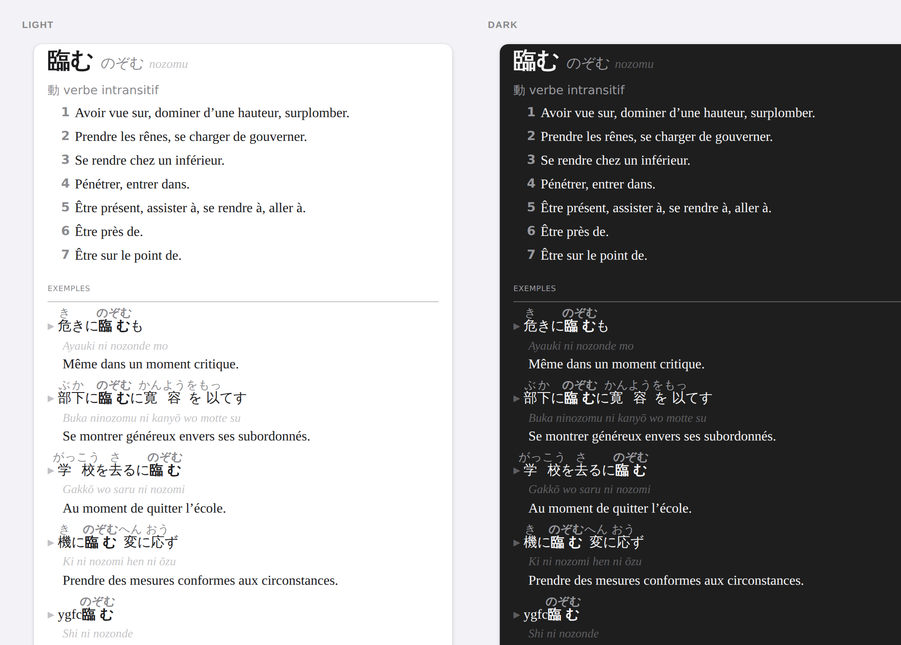

# Japanese ↔ French dictionary for the macOS Dictionary app

Builds a native `.dictionary` bundle for Dictionary.app from the free data of the [Jibiki project](https://jibiki.fr).

The dictionary translates between Japanese and French.

Contents:

- Japanese → French from:
    - the Cesselin dictionary (1940)
    - JMdict
    - Wikipedia
- French → Japanese from:
    - Raguet‑Martin dictionary
    - Wikipedia

Searchable in kanji (臨む), in kana (のぞむ), in rōmaji (`nozomu`, with or without macrons) and in French (with or without accents).

A syllabic `n` before a vowel or `y` answers to all four of its spellings:

- `han.i` (the Jibiki notation)
- `han'i` (Hepburn)
- `han-i`
- `hani`




## Disclaimer

This project was written with the assistance of Claude (Anthropic).


## Requirements

- git
- macOS and Python 3.9+
- ~1.5 GB of temporary disk space in the work folder


## Usage

### 1. Get the data (by hand)

[Download both volumes](https://jibiki.fr/data/) (data under the CC0 licence Mathieu Mangeot‑Nagata, LIG / GETALP, Grenoble):

- `jibiki.fr_jpn_fra.xml.gz`
- `jibiki.fr_fra_jpn.xml.gz`

Drop them in the folder you run the script from.

### 2. Build the dictionary

```bash
python3 jibiki_dict.py
```

No dependencies: the Python 3.9+ standard library only.

Two steps:

1. conversion to Apple's XML format
2. compilation with Apple's Dictionary Development Kit
    - using the specified version of the DDK from [Additional Tools for Xcode](https://developer.apple.com/download/all/)
    - or downloading it automatically from a [GitHub mirror](https://github.com/nanoskript/dictionary-development-kit)

The script prints the path of the bundle it produced: `build/Japonais-Francais (Jibiki).dictionary`.

### 3. Install (by hand)

- move that bundle into `~/Library/Dictionaries`
- open Dictionary.app
- open "Dictionary menu → Settings" 
- tick "Japonais‑Français (Jibiki)"


## Options

```bash
python3 jibiki_dict.py --steps convert                                      # Stop after the conversion.
python3 jibiki_dict.py --steps compile                                      # Resume at the compilation.
python3 jibiki_dict.py --no-examples                                        # Without the examples.
python3 jibiki_dict.py --no-english                                         # Drop JMdict's English only.
python3 jibiki_dict.py --work-dir ~/dict                                    # Another work folder.
python3 jibiki_dict.py --ddk "~/Dictionary Development Kit"                 # DDK already installed.
python3 jibiki_dict.py --jpn-fra ~/tmp/a.xml.gz --fra-jpn ~/tmp/b.xml.gz
```

Without `--jpn-fra` / `--fra-jpn`, both volumes are looked for in the current folder then in the work folder, under the jibiki.fr names (with or without the `.xml` extension)


## Things to know

- compilation takes several minutes and stays silent for a long while: that is normal
- the Cesselin data comes from an OCR scan of a 1940 work:
    - the odd bit of dross turns up (`ygfc`, `[-]`, `mût?`) and the French is sometimes dated
    - that is the price of the density, no other free Japanese‑French dictionary has this coverage
- some 41 000 entries only carry an English gloss (JMdict entries with no French translation)
    - they are flagged with an `en` badge
    - `--no-english` drops them
- in the French → Japanese volume:
    - the original Raguet‑Martin convention is kept as it stands: Japanese is written in rōmaji with the kanji as ruby annotations


## Development

`ruff` is the only development dependency.

You can install `ruff` with `uv`.

By default, `uv sync` creates a virtual environment at `.venv` and installs/synchronizes the project's dependencies:

```bash
uv sync
```

You can then activate the virtual environment:

```bash
source .venv/bin/activate
```

To run `ruff`:

```bash
make lint
```


## Tests

To run the tests:

```bash
make test
```

`tests/context.py` is the plumbing every test uses:

- finds `jibiki_dict.py` and imports it as `jd`
- `entries(volume)` runs the converter over one sample file and returns the list of `<d:entry>` strings it produced
- `document(volume)` wraps those entries into a complete XML document, ready to be compared or parsed

The snapshot test:

- `document("jpn_fra")` and `document("fra_jpn")` are compared, character for character, with `tests/expected/*.xml`
- any change to the markup that shows up in the 24 sample articles fails it, by design
- the failure message does not print the diff (it would be a wall of XML)
- the move is: `make snapshots`, then `git diff tests/expected`
- if the diff is what you intended, commit it; if not, you have found your regression and `git checkout` restores the reference
- this only works if `tests/expected/` is committed: `make snapshots` overwrites it in place

Other tests cover the rules we discovered the hard way:

- the XML parses
- identifiers are unique within each volume
- every entry carries at least one search key, and the `entry` class
- no tag comes out empty
- senses are numbered only when there are several
- the part of speech sits in its own block rather than trailing the headword
- three stylesheet guards: the essential CSS rules are still present, colours are Apple's semantic ones rather than opacity, ruby annotations are at 85 % or more

The sample is 24 real articles, picked for the cases that caused trouble:

- multiple headwords, English-only gloss, wholly empty example
- the syllabic n (範囲, 蒟蒻)
- a fourteen-sense entry, and a feminine form
- Latin abbreviations and spelling variants are not in the sample they are covered by the unit tests only

Not covered at all: the rendering itself, and the compilation. The first goes through `make preview` and your eyes; the second needs macOS and the DDK.


## Seeing the result

```bash
make preview                   # A varied pick, in light and dark.
make preview WORDS="水 argent"  # The entries of your choice.
```

`preview.py` writes a page where the same entries are rendered side by side in both themes, with the dictionary's real stylesheet.

Apple's semantic colours, which a browser knows nothing about, are replaced by their equivalents.

The working loop is three gestures: change the CSS in `jibiki_dict.py`, run again, refresh — without recompiling the 220 MB.

By default the preview draws from the test sample, so it appears instantly; `--volumes <folder>` goes looking in the full volumes.
